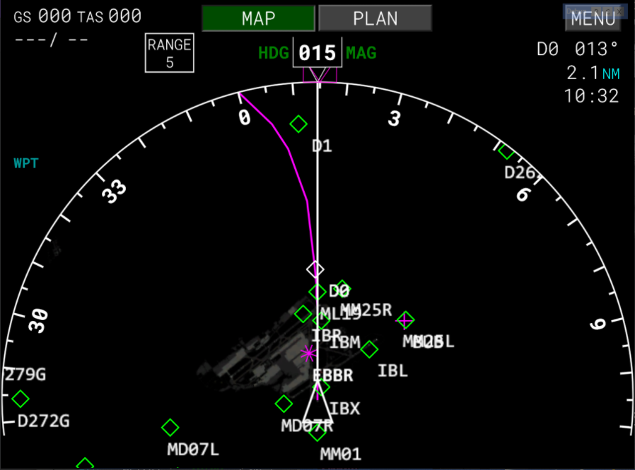
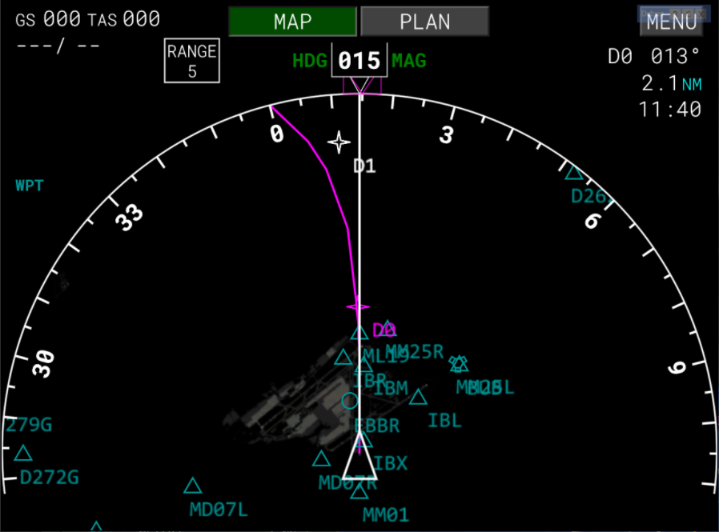
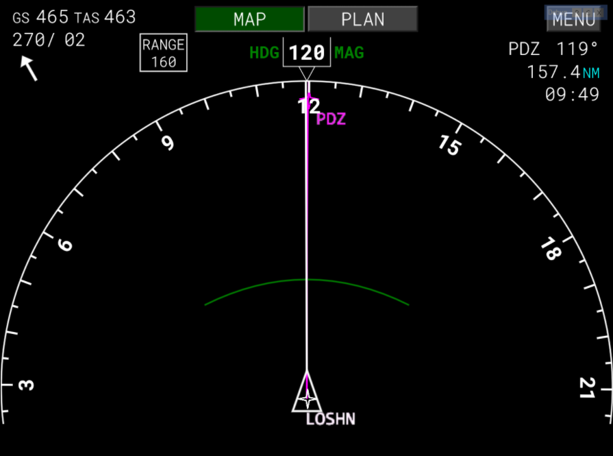
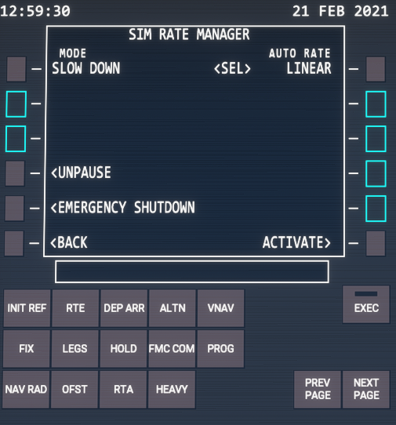

# B78XHL (B787-10 Heavy) Lite version

## About

B78XHL is an open source and free modification of default Boeing 787-10 in Microsoft Flight Simulator. B78XHL is a "Lite" version of our B78XH modification.

## Features Overview

* ### FMC
    * #### VNAV
        * CLB Speed Restriction implemented
        * CLB Selected speed implemented
        * CLB Trans altitude is settable
        * CLB Page active speed is highlighted by magenta
    * #### LEGS
        * Cruise speed fixed
    * #### ROUTE
        * Airways support
        * All waypoints between first and last added waypoint are inserted to Legs page
    * #### MISC
        * "HEAVY" button added (misc & configuration of mod)
    
* ### ND/MFD
  * Symbols changed to default Boeing symbols
  * Altitude prediction added (Green Banana)
    
* ### EICAS / SYS
    *  Gears synoptic page
    *  Hydraulics synoptic page
    *  Stat page
    *  FCTL synoptic page
    *  AIR synoptic page (static)

* ### MISC
    *  Added HEAVY configuration page
    *  Payload Manager added to HEAVY configuration page

* ### Payload manager
    * CG range 0 - 100%
    * FOB range 0 - 33384 Gallons
    * Payload range 0 - 560000 Pounds
    * FOB can be set only in Gallons
    * Payload can be set only in Pounds
    * Fuel tanks priority groups:
      * LEFT MAIN, RIGHT MAIN
      * CENTER
    * "new" ZFW is set automatically by payload manager
    * manager do not check "GrossWeight" > "Max takeoff weight" (you can overload an aircraft)

* ### SimRate manager
    * Modes:
        * slow down - change sim rate to 1x few miles before TOD or DECEL waypoint
        * pause - pause game few miles before TOD or DECEL waypoint
    * Rate Modes:
        * Off - do nothing (do not change sim rate)
        * Linear - Change sim rate to 4x and hold.
        * Normal - Change sim rate to 4x and hold. 5nm before waypoint change sim rate to 2x and hold. 3nm after waypoint change sim rate to 4x and hold.
        * Aggressive - change sim rate to 8x and hold (!!!Do not use this mode now!!!)
    * Unpause button - unpause game when the game is paused by sim rate manager (this is the only way how to unpause game)
    * Emergency shutdown - Terminates all sim rate manager interventions immediately. During an emergency shutdown is not possible to use FMC for 6 seconds. You will be able to deactivate an emergency shutdown or leave the page without deactivation after 6 seconds.

# ND

| Default MSFS 787 ND | B787-10 Heavy ND|
|---------------------|-----------------|
|||

| Symbol (default)    | Symbol (Heavy)  | Name |ND Mode | Remarks |
|:---------------------:|:-----------------:|------|--------|---------|
|||Off route waypoint|||
|||Waypoint inactive|||
|||Waypoint active|||
|||Airport|||
|||VOR|||
|||VOR/DME|||
|||TACAN|||
|||VORTAC|||

# ND - Altitude prediction (BANANA)

# SimRate Manager
